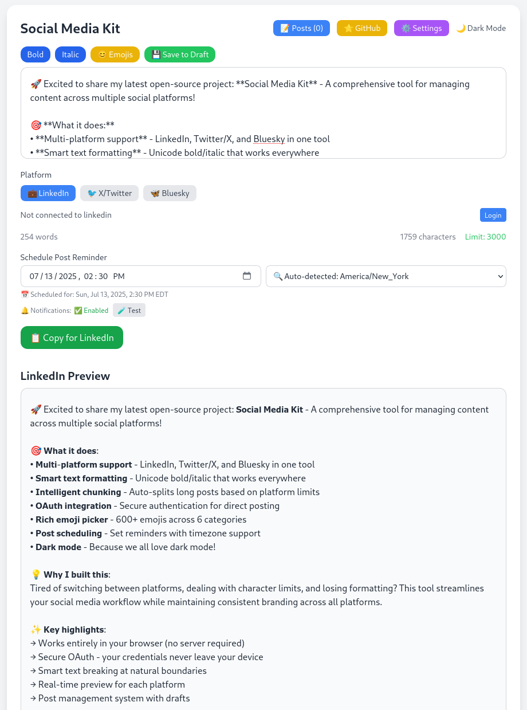

# Social Media Kit

*Made with ❤️ for the community*

A comprehensive social media management tool designed to help you create, format, and post content across multiple platforms including LinkedIn, Twitter/X, and Bluesky.

Features advanced styling, tagging, reminder, OAuth authentication, and cross-platform posting capabilities.

*⭐ Found this tool helpful? **Give it a star on GitHub** to support the project and help others discover it!*

<div align="center">
  
</div>

More screenshots can be found in [this folder](/screenshots).


## 🚀 Key Features

- **🌐 Multi-Platform Support** - Post to LinkedIn, Twitter/X, and Bluesky with OAuth authentication
- **✨ Advanced Formatting** - Bold (`**text**`) and italic (`_text_`) with Unicode styling
- **🏷️ Unified Tagging** - Use `@{Person Name}` syntax for cross-platform tagging
- **📝 Post Management** - Create, edit, and organize multiple posts with auto-save
- **😊 Emoji Picker** - 6 categories with easy insertion at cursor position
- **⏰ Scheduling & Reminders** - Set posting reminders with timezone support
- **🎨 Dark Mode** - Toggle between light/dark themes with persistence
- **📱 Direct Posting** - One-click posting with automatic thread creation

<details>
<summary><strong>📋 Detailed Features</strong></summary>

### 🌐 **Multi-Platform Support**
- **LinkedIn**: OAuth 2.0 integration with direct posting (3,000 character limit)
- **Twitter/X**: OAuth 2.0 authentication with automatic thread creation (280 chars, or 25,000 with X Premium)
- **Bluesky**: App password authentication with native posting (300 character limit)
- **Smart Chunking**: Automatic text splitting based on platform-specific character limits
- **Visual Status**: Green checkmarks (✓) show authentication status for each platform

### ✨ **Advanced Text Formatting**
- **Bold Text**: Use `**text**` to create Unicode bold formatting (𝗯𝗼𝗹𝗱)
- **Italic Text**: Use `_text_` to create Unicode italic formatting (𝘪𝘵𝘢𝘭𝘪𝘤)
- **Cross-Platform Compatible**: Unicode characters work across all supported platforms
- **Live Preview**: Real-time preview of formatted text as you type
- **Intelligent Text Breaking**: Smart chunking at sentence and paragraph boundaries

### 🏷️ **Unified Tagging System**
- **Cross-Platform Tagging**: Use `@{Person Name}` syntax to tag people across all platforms
- **Smart Platform Conversion**: Automatically converts to platform-specific formats:
  - LinkedIn: `@Display Name` (manual tagging required after pasting)
  - Twitter/X: `@username` (automatic clickable mentions)
  - Bluesky: `@handle.domain` (automatic clickable mentions and links with AT Protocol facets)
- **Person Management**: Add, edit, and delete person mappings with platform-specific handles
- **Inline Editing**: Edit existing person mappings directly in the tag manager
- **Visual Tagging Guide**: Clear instructions and examples for each platform
- **Persistent Storage**: All person mappings saved to localStorage

### 🔐 **OAuth & Authentication**
- **Settings UI**: Built-in OAuth configuration panel with step-by-step instructions
- **LinkedIn OAuth**: OAuth 2.0 with `w_member_social` scope for posting
- **Twitter OAuth**: OAuth 2.0 with `tweet.read`, `tweet.write`, `users.read` scopes
- **Bluesky Authentication**: Secure app password system
- **Token Management**: Automatic token storage, persistence, and refresh handling

### 📝 **Post Management System**
- **Create & Edit**: Multiple posts with custom titles and content
- **Save & Load**: Export/import posts to/from JSON files
- **Post Switching**: Easy navigation between saved posts
- **Auto-Save**: Drafts automatically saved to localStorage
- **Post Counter**: Visual indicator of total saved posts

### ⏰ **Scheduling & Reminders**
- **Date/Time Picker**: Set reminders for when to post
- **32+ Timezone Support**: Global timezone selections
- **Browser Notifications**: Get notified when it's time to post
- **Timezone Display**: Shows scheduled time in selected timezone

### 🎨 **User Experience**
- **Dark Mode**: Toggle between light and dark themes with persistence
- **Responsive Design**: Works on desktop and mobile devices
- **Visual Feedback**: Loading states, success/error messages, and status indicators
- **Character Counting**: Real-time word and character count with limit warnings
- **Multiple Copy Methods**: Clipboard API with fallbacks for different browsers

### 📱 **Direct Posting Capabilities**
- **One-Click Posting**: Post directly to authenticated platforms
- **Multi-Part Posts**: Automatic thread creation for long content
- **Posting Status**: Real-time feedback during posting process
- **Error Handling**: Clear error messages and retry options
- **Sequential Posting**: Automatic delays between multi-part posts

</details>

## 🛠️ Tech Stack

- **React 18** with TypeScript for type safety
- **Vite** for fast development and building
- **Tailwind CSS** for responsive styling
- **Marked** for markdown parsing
- **DOMPurify** for safe HTML sanitization
- **localStorage** for data persistence
- **Express.js** backend server for OAuth token exchange
- **Node.js** server-side API endpoints for secure posting

## 📦 Installation

### Prerequisites
- **Node.js** (version 16 or higher)
- **npm** (comes with Node.js)

### Setup Steps

1. **Clone the repository**
   ```bash
   git clone https://github.com/terrytangyuan/social-media-kit
   cd social-media-kit
   ```

2. **Install dependencies**
   ```bash
   npm install
   ```

3. **Set up environment variables**
   ```bash
   cp .env.example .env
   # Edit .env file with your LinkedIn and Twitter client secrets
   ```

4. **Start the production server**
   ```bash
   npm start
   ```

5. **Open your browser**
   - Navigate to `http://localhost:3000`
   - The app serves both frontend and backend from the same port

📋 **For detailed setup instructions including OAuth configuration, see [Complete Setup Guide](SETUP.md)**

### Development Mode

For development with hot reload:

```bash
# Terminal 1: Start the backend server
npm run server

# Terminal 2: Start the frontend dev server
npm run dev
```

### Build for Production

```bash
npm run build
```

The built files will be in the `dist` directory.

## 🎯 Quick Start

1. **⚙️ Setup OAuth** - Configure LinkedIn/Twitter client IDs or Bluesky app password
2. **✍️ Write Posts** - Use `**bold**`, `_italic_`, and `@{Person Name}` for tagging
3. **🎯 Select Platform** - Choose LinkedIn, Twitter/X (with optional X Premium), or Bluesky
4. **📤 Post** - Click "Post to [Platform]" or copy for manual posting

<details>
<summary><strong>📖 Detailed Usage Guide</strong></summary>

### **1. Setting Up Authentication**
1. Click the **⚙️ Settings** button in the top header
2. Follow the platform-specific setup instructions:
   - **LinkedIn**: Get Client ID from LinkedIn Developer Portal
   - **Twitter**: Get Client ID from Twitter Developer Portal  
   - **Bluesky**: Generate app password in Bluesky settings
3. Paste your credentials and they'll be automatically saved

### **2. Writing Your Post**
- Type your content in the main text area
- Use `**text**` for bold formatting
- Use `_text_` for italic formatting
- Watch the character count and platform limits

### **3. Adding Emojis**
- Click the **😊 Emojis** button (positioned with Bold/Italic buttons)
- Browse through 6 organized categories
- Click any emoji to insert it at your cursor position
- The picker closes automatically after selection

### **4. Platform Selection & Posting**
- **Select Platform**: Choose from LinkedIn (💼), Twitter/X (🐦), or Bluesky (🦋)
- **X Premium**: When Twitter/X is selected, toggle "X Premium Account" for 25,000 character limit
- **Authentication**: Click "Login" if you see a not-connected status
- **Direct Posting**: Click "Post to [Platform]" to publish directly
- **Copy Option**: Use "📋 Copy for [Platform]" if you prefer manual posting
- **Thread Handling**: Long posts are automatically split into threads

### **5. Using Unified Tagging**
- Click **🏷️ Tags** to open the Tag Manager
- **Add Person**: Create person mappings with name and platform-specific handles
  - **Name**: Used for tagging syntax (e.g., "Yuan Tang")
  - **Display Name**: What appears in posts (e.g., "Yuan Tang")
  - **X/Twitter**: Username handle (e.g., "TerryTangYuan")
  - **Bluesky**: Handle with domain (e.g., "terrytangyuan.xyz")
- **Tag in Posts**: Use `@{Person Name}` syntax in your posts
- **Platform Conversion**: Automatically converts to platform-specific formats:
  - LinkedIn: `@Yuan Tang` (requires manual @ selection after pasting)
  - Twitter/X: `@TerryTangYuan` (automatic clickable mention)
  - Bluesky: `@terrytangyuan.xyz` (automatic clickable mention with AT Protocol facets)
- **Edit/Delete**: Use the ✏️ Edit and 🗑️ Delete buttons to manage mappings

### **6. Managing Multiple Posts**
- Click **📝 Posts** to access the post manager
- **Create**: Use "➕ New Post" to create additional posts
- **Switch**: Click any post to switch to editing it
- **Export/Import**: Use "💾 Save" and "📁 Load" to backup/restore posts
- **Organize**: Edit post titles by clicking on them

</details>

### **6. Scheduling Reminders**
- Use the "Schedule Post Reminder" datetime picker
- Select your timezone from 32+ global options
- Browser notifications will alert you at the scheduled time
- Reminders persist across browser sessions

### **7. Dark Mode**
- Click the **🌙 Dark Mode** / **🌞 Light Mode** toggle
- All interface elements adapt to your chosen theme
- Your preference is automatically saved

</details>

<details>
<summary><strong>🔧 Technical Details</strong></summary>

### **Unicode Text Formatting**
The app converts markdown syntax to Unicode characters that work across all platforms:
- `**bold text**` → **𝗯𝗼𝗹𝗱 𝘁𝗲𝘅𝘁**
- `_italic text_` → _𝘪𝘵𝘢𝘭𝘪𝘤 𝘵𝘦𝘹𝘵_

### **Smart Text Chunking**
Automatically splits long content based on platform limits:
- **LinkedIn**: 3,000 characters (generous limit for long-form content)
- **Twitter/X**: 280 characters (25,000 with X Premium) - creates automatic threads
- **Bluesky**: 300 characters (creates post series)

Chunking intelligently breaks at:
1. Sentence endings (., !, ?)
2. Paragraph breaks (\n\n)
3. Line breaks (\n)
4. Word boundaries (spaces)

### **Persistent Storage**
- **Drafts**: Auto-saved to localStorage as you type
- **Posts**: All posts saved locally with export/import capability
- **Settings**: OAuth configurations and preferences persist
- **Authentication**: Tokens securely stored locally
- **Theme**: Dark mode preference remembered

### **Platform Character Limits**
- **LinkedIn**: 3,000 characters (professional long-form posts)
- **Twitter/X**: 280 characters (25,000 with X Premium) - microblogging to long-form
- **Bluesky**: 300 characters (short-form social content)

</details>

## 🤖 MCP API for AI Agents

**NEW**: Complete Model Context Protocol (MCP) compatible API for agentic workflows!

### Quick Start
```bash
# Get available tools
curl http://localhost:3000/api/mcp/tools

# Format text with Unicode styling
curl -X POST http://localhost:3000/api/mcp/format-text \
  -H "Content-Type: application/json" \
  -d '{"text":"**Bold** and _italic_ text"}'

# Test all endpoints
npm run test:mcp
```

### Available Tools
- **Text Processing**: Format, count characters, chunk for threading
- **Post Management**: Create, read, update, delete posts  
- **Person Mappings**: Manage unified tagging across platforms
- **Platform Integration**: Get limits, preview formatted content

📖 **Full Documentation**: [MCP_API.md](MCP_API.md) - Complete API reference with examples and integration patterns

## 🌟 Pro Tips

- **⚙️ Setup First** - Configure OAuth credentials before posting
- **🏷️ Use Unified Tagging** - Create person mappings, then use `@{Person Name}` syntax
- **💼 LinkedIn Tagging** - After pasting, manually type `@` and select from dropdown
- **✨ Format Wisely** - Use bold text sparingly for key points
- **📋 Always Preview** - Review formatted content before publishing

## 🐛 Common Issues

**Authentication Problems:**
- **"CLIENT ID NOT CONFIGURED"** → Add credentials to `.env` file and restart server
- **OAuth redirect fails** → Verify redirect URLs match exactly (`http://localhost:3000`)
- **LinkedIn 403 errors** → Enable required products in LinkedIn Developer Portal
- **Twitter auth errors** → Verify app type is "Web App" (not "Confidential Client")

**Server Issues:**
- **Port 3000 in use** → Kill existing processes: `sudo lsof -ti:3000 | xargs sudo kill -9`
- **Module not found** → Run `npm install` to install dependencies

📋 **For detailed troubleshooting and recent fixes, see [CHANGELOG.md](CHANGELOG.md)**

## 📝 License

This project is open source and available under the [MIT License](LICENSE).

## 🤝 Contributing

We welcome contributions from developers of all skill levels! Whether you're fixing bugs, adding features, improving documentation, or enhancing tests, your help makes this project better.

📋 **For detailed guidelines, see [CONTRIBUTING.md](CONTRIBUTING.md)**

---

**Made with ❤️ for better social media content creation and cross-platform posting**
