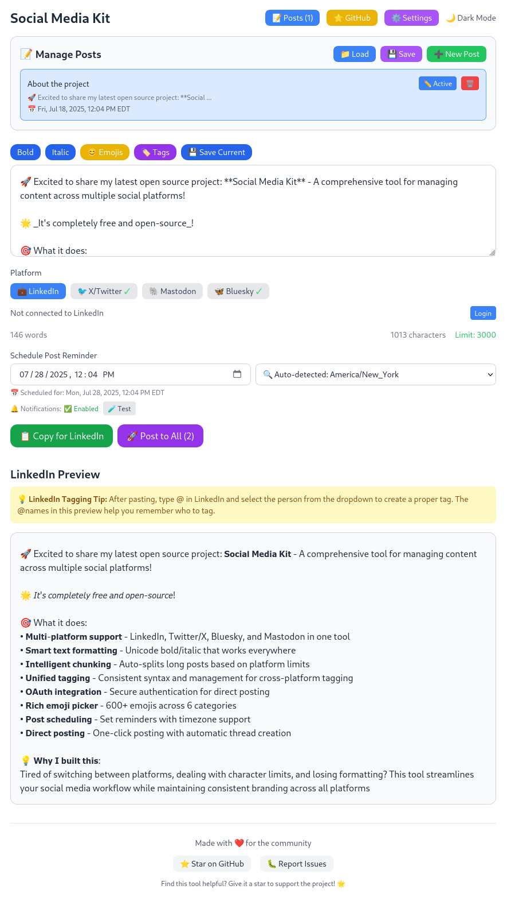

<div align="left">
  <a href="https://x.com/TerryTangYuan"></a>
  <a href="https://www.linkedin.com/in/terrytangyuan"></a>
  <a href="https://bsky.app/profile/terrytangyuan.xyz"></a>
  <a href="https://fosstodon.org/@terrytangyuan"></a>
  <a href="https://github.com/sponsors/terrytangyuan"></a>
</div>

# Social Media Kit

*Made with ❤️ for the community*

A comprehensive social media management tool designed to help you create, format, and post content across multiple platforms including LinkedIn, Twitter/X, Mastodon, and Bluesky.

Features advanced styling, tagging, reminder, OAuth authentication, and cross-platform posting capabilities.

*⭐ Found this tool helpful? **Give it a star on GitHub** to support the project and help others discover it!*

<div align="center">
  
</div>

More screenshots can be found in [this folder](/screenshots).


## 🚀 Key Features

- **🌐 Multi-Platform Support** - Post to LinkedIn, Twitter/X, Mastodon, and Bluesky with OAuth authentication
- **✨ Advanced Formatting** - Bold (`**text**`) and italic (`_text_`) with Unicode styling
- **🏷️ Unified Tagging** - Use `@{Person Name}` syntax for cross-platform tagging
- **📝 Post Management** - Create, edit, and organize multiple posts with auto-save
- **😊 Emoji Picker** - 6 categories with easy insertion at cursor position
- **⏰ Scheduling & Reminders** - Set posting reminders with timezone support
- **🎨 Dark Mode** - Toggle between light/dark themes with persistence
- **📱 Direct Posting** - One-click posting with automatic thread creation

<details>
<summary><strong>📋 Detailed Features</strong></summary>

### 🌐 **Multi-Platform Support**
- **LinkedIn**: OAuth 2.0 integration with direct posting (3,000 character limit)
- **Twitter/X**: Hybrid authentication - OAuth 2.0 for tweets + OAuth 1.0a for image uploads (280 chars, or 25,000 with X Premium)
- **Mastodon**: OAuth 2.0 integration with instance-specific authentication and posting (500 character limit, configurable per instance)
- **Bluesky**: App password authentication with native posting (300 character limit)
- **Smart Chunking**: Automatic text splitting based on platform-specific character limits
- **Visual Status**: Green checkmarks (✓) show authentication status for each platform

### ✨ **Advanced Text Formatting**
- **Bold Text**: Use `**text**` to create Unicode bold formatting (𝗯𝗼𝗹𝗱)
- **Italic Text**: Use `_text_` to create Unicode italic formatting (𝘪𝘵𝘢𝘭𝘪𝘤)
- **Cross-Platform Compatible**: Unicode characters work across all supported platforms
- **Live Preview**: Real-time preview of formatted text as you type
- **Intelligent Text Breaking**: Smart chunking at sentence and paragraph boundaries

### 🏷️ **Unified Tagging System**
- **Cross-Platform Tagging**: Use `@{Person Name}` syntax to tag people across all platforms
- **Smart Platform Conversion**: Automatically converts to platform-specific formats:
  - LinkedIn: `@Display Name` (manual tagging required after pasting)
  - Twitter/X: `@username` (automatic clickable mentions)
  - Mastodon: `@username@instance.domain` (automatic clickable mentions)
  - Bluesky: `@handle.domain` (automatic clickable mentions and links with AT Protocol facets)
- **Person Management**: Add, edit, and delete person mappings with platform-specific handles
- **Inline Editing**: Edit existing person mappings directly in the tag manager
- **Visual Tagging Guide**: Clear instructions and examples for each platform
- **Persistent Storage**: All person mappings saved to localStorage

### 🔐 **OAuth & Authentication**
- **Settings UI**: Built-in OAuth configuration panel with step-by-step instructions
- **LinkedIn OAuth**: OAuth 2.0 with `w_member_social` scope for posting
- **Twitter OAuth**: Hybrid - OAuth 2.0 for user auth & tweets, OAuth 1.0a for image uploads
- **Mastodon OAuth**: OAuth 2.0 with `read write` scopes, instance-specific configuration
- **Bluesky Authentication**: Secure app password system
- **Token Management**: Automatic token storage, persistence, and refresh handling

### 📝 **Post Management System**
- **Create & Edit**: Multiple posts with custom titles and content
- **Save & Load**: Export/import posts to/from JSON files
- **Post Switching**: Easy navigation between saved posts
- **Auto-Save**: Drafts automatically saved to localStorage
- **Post Counter**: Visual indicator of total saved posts

### ⏰ **Scheduling & Reminders**
- **Date/Time Picker**: Set reminders for when to post
- **32+ Timezone Support**: Global timezone selections
- **Browser Notifications**: Get notified when it's time to post
- **Timezone Display**: Shows scheduled time in selected timezone

### 🎨 **User Experience**
- **Dark Mode**: Toggle between light and dark themes with persistence
- **Responsive Design**: Works on desktop and mobile devices
- **Visual Feedback**: Loading states, success/error messages, and status indicators
- **Character Counting**: Real-time word and character count with limit warnings
- **Multiple Copy Methods**: Clipboard API with fallbacks for different browsers

### 📱 **Direct Posting Capabilities**
- **One-Click Posting**: Post directly to authenticated platforms
- **Multi-Part Posts**: Automatic thread creation for long content
- **Posting Status**: Real-time feedback during posting process
- **Error Handling**: Clear error messages and retry options
- **Sequential Posting**: Automatic delays between multi-part posts

</details>

## 🛠️ Tech Stack

- **React 18** with TypeScript for type safety
- **Vite** for fast development and building
- **Tailwind CSS** for responsive styling
- **Marked** for markdown parsing
- **DOMPurify** for safe HTML sanitization
- **localStorage** for data persistence
- **Express.js** backend server for OAuth token exchange
- **Node.js** server-side API endpoints for secure posting

## 📦 Installation

### Prerequisites
- **Node.js** (version 16 or higher)
- **npm** (comes with Node.js)

### Setup Steps

1. **Clone the repository**
   ```bash
   git clone https://github.com/terrytangyuan/social-media-kit
   cd social-media-kit
   ```

2. **Install dependencies**
   ```bash
   npm install
   ```

3. **Set up environment variables**
   ```bash
   cp .env.example .env
   # Edit .env file with your LinkedIn and Twitter client secrets
   ```

4. **Start the production server**
   ```bash
   npm start
   ```

5. **Open your browser**
   - Navigate to `http://localhost:3000`
   - The app serves both frontend and backend from the same port

📋 **For detailed setup instructions including OAuth configuration, see [Complete Setup Guide](SETUP.md)**

## 🐳 Docker Deployment

Run the Social Media Kit using Docker for easy deployment without manual Node.js setup:

### Quick Start with Docker

```bash
# Clone the repository
git clone https://github.com/terrytangyuan/social-media-kit
cd social-media-kit

# Copy and configure environment variables
cp .env.example .env
# Edit .env with your OAuth credentials

# Start with Docker Compose
docker-compose up -d

# Access at http://localhost:3000
```

### Using Pre-built Image

```bash
# Pull from GitHub Container Registry
docker pull ghcr.io/terrytangyuan/social-media-kit:latest

# Run with your .env file
docker run -d -p 3000:3000 --env-file .env ghcr.io/terrytangyuan/social-media-kit:latest
```

📋 **For detailed Docker instructions, see [Docker Deployment Guide](DOCKER.md)**

### Development Mode

For development with hot reload:

```bash
# Terminal 1: Start the backend server
npm run server

# Terminal 2: Start the frontend dev server
npm run dev
```

### Build for Production

```bash
npm run build
```

The built files will be in the `dist` directory.

## 🎯 Quick Start

1. **⚙️ Setup OAuth** - Configure LinkedIn/Twitter/Mastodon client IDs or Bluesky app password
2. **✍️ Write Posts** - Use `**bold**`, `_italic_`, and `@{Person Name}` for tagging
3. **🎯 Select Platform** - Choose LinkedIn, Twitter/X (with optional X Premium), Mastodon, or Bluesky
4. **📤 Post** - Click "Post to [Platform]" or copy for manual posting

<details>
<summary><strong>📖 Detailed Usage Guide</strong></summary>

### **1. Setting Up Authentication**
1. Click the **⚙️ Settings** button in the top header
2. Follow the platform-specific setup instructions:
   - **LinkedIn**: Get Client ID from LinkedIn Developer Portal
   - **Twitter**: Get OAuth 2.0 Client ID + OAuth 1.0a credentials from Twitter Developer Portal  
   - **Bluesky**: Generate app password in Bluesky settings
3. Paste your credentials and they'll be automatically saved

### **2. Writing Your Post**
- Type your content in the main text area
- Use `**text**` for bold formatting
- Use `_text_` for italic formatting
- Watch the character count and platform limits

### **3. Adding Emojis**
- Click the **😊 Emojis** button (positioned with Bold/Italic buttons)
- Browse through 6 organized categories
- Click any emoji to insert it at your cursor position
- The picker closes automatically after selection

### **4. Platform Selection & Posting**
- **Select Platform**: Choose from LinkedIn (💼), Twitter/X (🐦), Mastodon (🐘), or Bluesky (🦋)
- **X Premium**: When Twitter/X is selected, toggle "X Premium Account" for 25,000 character limit
- **Authentication**: Click "Login" if you see a not-connected status
- **Direct Posting**: Click "Post to [Platform]" to publish directly
- **Copy Option**: Use "📋 Copy for [Platform]" if you prefer manual posting
- **Thread Handling**: Long posts are automatically split into threads

### **5. Using Unified Tagging**
- Click **🏷️ Tags** to open the Tag Manager
- **Add Person**: Create person mappings with name and platform-specific handles
  - **Name**: Used for tagging syntax (e.g., "Yuan Tang")
  - **Display Name**: What appears in posts (e.g., "Yuan Tang")
  - **X/Twitter**: Username handle (e.g., "TerryTangYuan")
  - **Bluesky**: Handle with domain (e.g., "terrytangyuan.xyz")
- **Tag in Posts**: Use `@{Person Name}` syntax in your posts
- **Smart Tag Autocomplete**: Type `@` in the editor to see available tag suggestions
  - **Fuzzy Search**: Filter suggestions by typing part of a person's name
  - **Keyboard Navigation**: Use arrow keys to navigate, Enter to select, Escape to close
  - **Auto-completion**: Automatically replaces `@partial` with `@{Full Name}` format
- **Platform Conversion**: Automatically converts to platform-specific formats:
  - LinkedIn: `@Yuan Tang` (requires manual @ selection after pasting)
  - Twitter/X: `@TerryTangYuan` (automatic clickable mention)
  - Bluesky: `@terrytangyuan.xyz` (automatic clickable mention with AT Protocol facets)
- **Edit/Delete**: Use the ✏️ Edit and 🗑️ Delete buttons to manage mappings

### **6. Managing Multiple Posts**
- Click **📝 Posts** to access the post manager
- **Create**: Use "➕ New Post" to create additional posts
- **Switch**: Click any post to switch to editing it
- **Export/Import**: Use "💾 Save" and "📁 Load" to backup/restore posts
- **Organize**: Edit post titles by clicking on them

</details>

### **6. Scheduling Reminders**
- Use the "Schedule Post Reminder" datetime picker
- Select your timezone from 32+ global options
- Browser notifications will alert you at the scheduled time
- Reminders persist across browser sessions

### **7. Dark Mode**
- Click the **🌙 Dark Mode** / **🌞 Light Mode** toggle
- All interface elements adapt to your chosen theme
- Your preference is automatically saved

</details>

<details>
<summary><strong>🔧 Technical Details</strong></summary>

### **Unicode Text Formatting**
The app converts markdown syntax to Unicode characters that work across all platforms:
- `**bold text**` → **𝗯𝗼𝗹𝗱 𝘁𝗲𝘅𝘁**
- `_italic text_` → _𝘪𝘵𝘢𝘭𝘪𝘤 𝘵𝘦𝘹𝘵_

### **Smart Text Chunking**
Automatically splits long content based on platform limits:
- **LinkedIn**: 3,000 characters (generous limit for long-form content)
- **Twitter/X**: 280 characters (25,000 with X Premium) - creates automatic threads
- **Bluesky**: 300 characters (creates post series)

Chunking intelligently breaks at:
1. Sentence endings (., !, ?)
2. Paragraph breaks (\n\n)
3. Line breaks (\n)
4. Word boundaries (spaces)

### **Persistent Storage**
- **Drafts**: Auto-saved to localStorage as you type
- **Posts**: All posts saved locally with export/import capability
- **Settings**: OAuth configurations and preferences persist
- **Authentication**: Tokens securely stored locally
- **Theme**: Dark mode preference remembered

### **Platform Character Limits**
- **LinkedIn**: 3,000 characters (professional long-form posts)
- **Twitter/X**: 280 characters (25,000 with X Premium) - microblogging to long-form
- **Mastodon**: 500 characters (configurable per instance) - microblogging with threading support
- **Bluesky**: 300 characters (short-form social content)

</details>

## 🌟 Pro Tips

- **⚙️ Setup First** - Configure OAuth credentials before posting
- **🏷️ Use Unified Tagging** - Create person mappings, then use `@{Person Name}` syntax
- **💼 LinkedIn Tagging** - After pasting, manually type `@` and select from dropdown
- **✨ Format Wisely** - Use bold text sparingly for key points
- **📋 Always Preview** - Review formatted content before publishing

## 🐛 Common Issues

**Authentication Problems:**
- **"CLIENT ID NOT CONFIGURED"** → Add credentials to `.env` file and restart server
- **OAuth redirect fails** → Verify redirect URLs match exactly (`http://localhost:3000`)
- **LinkedIn 403 errors** → Enable required products in LinkedIn Developer Portal
- **Twitter auth errors** → Verify app type is "Web App" (not "Confidential Client")

**Server Issues:**
- **Port 3000 in use** → Kill existing processes: `sudo lsof -ti:3000 | xargs sudo kill -9`
- **Module not found** → Run `npm install` to install dependencies

📋 **For detailed troubleshooting and recent fixes, see [CHANGELOG.md](CHANGELOG.md)**

## 📝 License

This project is open source and available under the [MIT License](LICENSE).

## 🤝 Contributing

We welcome contributions from developers of all skill levels! Whether you're fixing bugs, adding features, improving documentation, or enhancing tests, your help makes this project better.

📋 **For detailed guidelines, see [CONTRIBUTING.md](CONTRIBUTING.md)**

## 🙏 Acknowledgements

This project was developed with the assistance of AI Code Assistant tools, which helped with:

- **Code Architecture & Implementation**: Structuring the multi-platform authentication system and API integrations
- **Problem Solving**: Debugging complex OAuth flows, token refresh mechanisms, and cross-platform compatibility issues  
- **Documentation**: Creating comprehensive setup guides, API documentation, and troubleshooting resources
- **Testing & Quality Assurance**: Implementing robust error handling, input validation, and automated testing
- **User Experience**: Designing intuitive interfaces and optimizing the posting workflow across platforms

We acknowledge the valuable role of AI assistance in accelerating development while maintaining code quality and best practices. The project combines human creativity and decision-making with AI-powered coding assistance to deliver a robust social media management tool.

---

**Made with ❤️ for better social media content creation and cross-platform posting**
